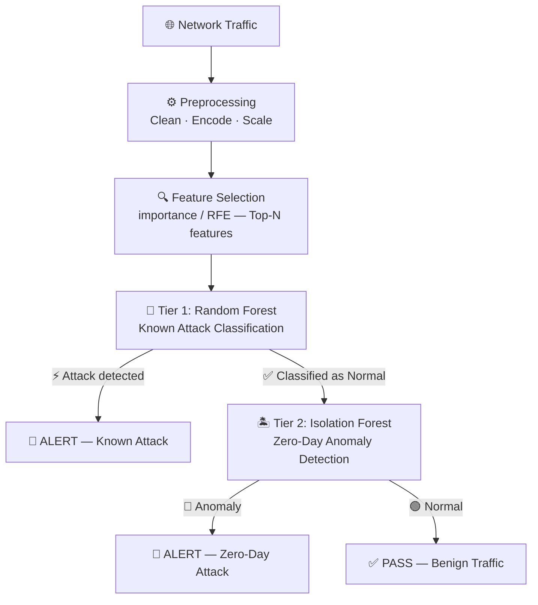

# 🛡️ Network Intrusion Detection System (NIDS)

A **production-grade Hybrid Machine Learning system** for detecting network intrusions. Combines a supervised Random Forest for known attacks with an Isolation Forest for zero-day anomaly detection.

---

## ✨ Key Features

- **Hybrid Two-Tier Architecture** — Supervised + unsupervised detection cascade
- **Multi-Dataset Support** — NSL-KDD and UNSW-NB15 (plug-in architecture for more)
- **SMOTE Balancing** — Handles class imbalance in real-world traffic data
- **SHAP Explainability** — Understand why each prediction was made
- **REST API** — Deploy as a microservice with Docker
- **YAML Config-Driven** — Fully configurable without touching code

---

## 🧠 How It Works



---

## 📊 Performance

| Dataset       | Recall    | Precision | F1-Score  | Attack Detection Rate |
| ------------- | --------- | --------- | --------- | --------------------- |
| NSL-KDD       | 72.4%     | 82.5%     | 70.8%     | 68.3%                 |
| **UNSW-NB15** | **95.2%** | **100%**  | **97.5%** | **100%**              |

> Results from default configuration. UNSW-NB15 is the **recommended dataset** for production use.

---

## 🚀 Quick Start

### 1. Install

```powershell
git clone https://github.com/jivi001/Network-IDS-ML.git
cd Network-IDS-ML

# Create and activate virtual environment
python -m venv nids_env
nids_env\Scripts\activate      # Windows
# source nids_env/bin/activate  # Linux/Mac

pip install -r requirements.txt
```

### 2. Download Dataset

```powershell
# Automated download (NSL-KDD public mirror)
python scripts/download_data.py --dataset nsl-kdd

# UNSW-NB15 (will prompt with manual download link as it requires registration)
python scripts/download_data.py --dataset unsw-nb15
```

Or place files manually in `data/raw/`.

### 3. Train

```powershell
# UNSW-NB15 (recommended)
python scripts/train.py --config configs/training/unsw_nb15.yaml

# NSL-KDD (default)
python scripts/train.py --config configs/training/default.yaml

# NSL-KDD (optimized hyperparameters)
python scripts/train.py --config configs/training/optimized.yaml
```

Results are saved to `experiments/runs/<experiment_id>/`.

### 4. Evaluate

```powershell
python scripts/evaluate.py \
  --model "experiments/runs/<experiment_id>/models" \
  --dataset "data/raw/unsw_nb15_test.csv" \
  --dataset-type unsw_nb15
```

---

## 📁 Project Structure

```
Network-IDS-ML/
├── nids/                        # Core Python package
│   ├── data/                    # Data loading & validation
│   ├── preprocessing/           # Cleaning, scaling, SMOTE
│   ├── features/                # Feature selection (RFE / importance)
│   ├── models/                  # Random Forest, Isolation Forest, Hybrid
│   ├── evaluation/              # Metrics & plots
│   ├── explainability/          # SHAP interpretability
│   ├── pipelines/               # Training / evaluation / inference
│   └── utils/                   # Config & logging helpers
├── configs/
│   ├── datasets/                # nsl_kdd.yaml, unsw_nb15.yaml
│   ├── models/                  # RF & iForest hyperparameters
│   └── training/                # default.yaml, optimized.yaml, unsw_nb15.yaml
├── scripts/
│   ├── data/                    # Dataset preparation scripts
│   │   └── prepare_unsw_nb15.py
│   ├── train.py                 # Training CLI
│   ├── evaluate.py              # Evaluation CLI
│   └── cross_dataset_eval.py   # Cross-dataset benchmarking
├── deployment/
│   ├── Dockerfile               # python:3.11-slim
│   ├── docker-compose.yml
│   └── inference_api.py         # FastAPI REST API (Swagger at /docs)
├── data/
│   ├── raw/                     # Original dataset files (git-ignored)
│   │   ├── UNSW-NB15/           # Raw UNSW-NB15 CSVs
│   │   ├── nsl_kdd_train.csv
│   │   └── nsl_kdd_test.csv
│   ├── processed/               # Preprocessed data (.gitkeep)
│   └── interim/                 # Intermediate files (.gitkeep)
├── experiments/
│   └── runs/                    # Auto-generated per-run outputs (.gitkeep)
├── models/                      # Promoted production models (.gitkeep)
├── notebooks/
│   └── exploration.ipynb
├── tests/
│   ├── unit/
│   │   ├── test_models.py
│   │   ├── test_inference.py
│   │   └── test_preprocessor.py
│   └── integration/
│       └── test_api.py
├── .github/
│   └── workflows/
│       └── ci.yml               # Lint + test + Docker build
├── .env.example                 # Environment variable template
├── docs/
├── requirements.txt
├── setup.py
├── pytest.ini
└── README.md
```

---

## ⚙️ Configuration

All configs live in `configs/`. Key training options in any `configs/training/*.yaml`:

| Key                            | Description                                          |
| ------------------------------ | ---------------------------------------------------- |
| `feature_selection.method`     | `importance` (fast) or `rfe` (slower, more accurate) |
| `feature_selection.n_features` | Number of top features to use                        |
| `preprocessing.apply_smote`    | `true`/`false` — enable class balancing              |
| `evaluation.compute_shap`      | `true`/`false` — SHAP feature importance plots       |

---

## 🐳 Docker Deployment

```powershell
cd deployment
docker-compose up --build
```

API will be available at `http://localhost:8000`.

- **Swagger UI**: http://localhost:8000/docs
- **Health check**: http://localhost:8000/health

See [DEPLOYMENT_GUIDE.md](docs/DEPLOYMENT_GUIDE.md) for full API reference.

---

## 📖 Documentation

| Doc                                             | Description           |
| ----------------------------------------------- | --------------------- |
| [GETTING_STARTED.md](docs/GETTING_STARTED.md)   | Beginner's guide      |
| [TRAINING_GUIDE.md](docs/TRAINING_GUIDE.md)     | Training walkthrough  |
| [DEPLOYMENT_GUIDE.md](docs/DEPLOYMENT_GUIDE.md) | Production deployment |
| [DOCKER_GUIDE.md](docs/DOCKER_GUIDE.md)         | Docker setup          |
| [API_REFERENCE.md](docs/API_REFERENCE.md)       | Full API docs         |

---

## 📄 License

MIT License — see [LICENSE](LICENSE).

---

## 📧 Contact

- **GitHub**: [@jivi001](https://github.com/jivi001)
- **Email**: jiviteshgd28@gmail.com
- **Issues**: [GitHub Issues](https://github.com/jivi001/Network-IDS-ML/issues)

---

## 🙏 Acknowledgments

- [NSL-KDD Dataset](https://www.unb.ca/cic/datasets/nsl.html) — University of New Brunswick
- [UNSW-NB15 Dataset](https://research.unsw.edu.au/projects/unsw-nb15-dataset) — UNSW Canberra
- [scikit-learn](https://scikit-learn.org/) community
