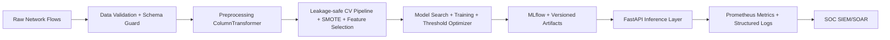

# Network-IDS-ML Enterprise SOC Platform

## Architecture Diagram


## System Workflow
1. Download/prepare dataset and validate schema/null/duplicates.
2. Build deterministic training pipeline from YAML config.
3. Execute CV-based scoring and optimize threshold using F2 over PR curve.
4. Train/refit best estimator, save model bundle (`model.joblib`, `metadata.json`, `metrics.json`, `feature_list.json`, `config_snapshot.json`).
5. Serve `/predict`, `/predict/batch`, `/explain`, `/metrics`, `/health` from FastAPI.

## Final Folder Structure
- `src/preprocessing`, `src/feature_selection`, `src/models`, `src/training`, `src/evaluation`, `src/inference`, `src/explainability`, `src/api`, `src/utils`
- `requirements/`, `configs/`, `deployment/`, `tests/`, `docs/`, `scripts/`
- `.github/workflows/`

## Data & Configuration
- Example train config: `configs/training/enterprise.yaml`
- Dataset downloader: `python scripts/download_datasets.py --name nsl_kdd_sample --output-dir data/raw`
- `.env` is supported for API runtime options (e.g., `LOG_LEVEL`, `MODEL_ARTIFACT_DIR`).

## How to Train
```bash
python -m src.training.training --config configs/training/enterprise.yaml
```

## How to Deploy (Docker)
```bash
docker compose -f deployment/docker-compose.yml up --build -d
```

## How to Test
```bash
pytest --cov=src --cov-report=term-missing
```

## Example API Request
```bash
curl -X POST http://localhost:8000/predict \
  -H "Content-Type: application/json" \
  -d '{"records":[{"duration":10,"src_bytes":20,"dst_bytes":30,"wrong_fragment":0,"urgent":0,"protocol_type":"tcp","service":"http","flag":"SF"}],"threshold_override":0.52}'
```

## Metrics Table
| Metric | Description |
|---|---|
| Precision | Alert quality |
| Recall | Attack catch rate |
| F1 | Harmonic balance |
| F2 | Recall-weighted SOC objective |
| PR-AUC | Minority-class quality |
| ROC-AUC | Ranking quality |
| False Positive Rate | SOC noise pressure |
| Per-class Recall | Attack-class visibility |
| Confusion Matrix | Triage context |

## Limitations
- SHAP endpoint is focused on tree-compatible estimators.
- Drift detection is currently a strategy placeholder hook.

## Future Roadmap
- Concept drift scoring and automated retraining workflow.
- Adversarial robustness stress-testing suite.
- Canary model release/rollback playbooks.
